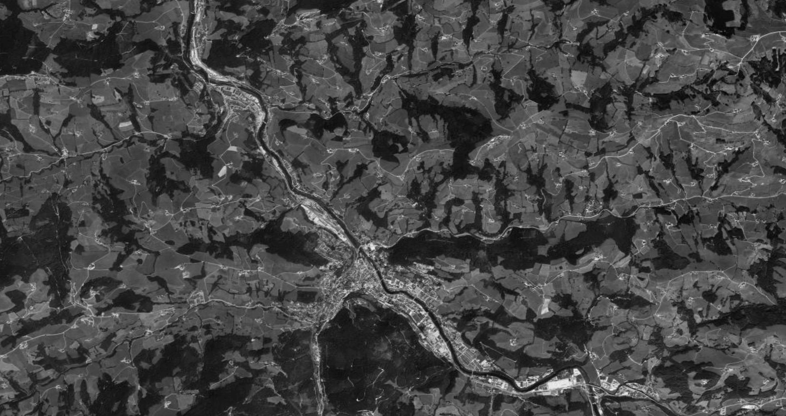
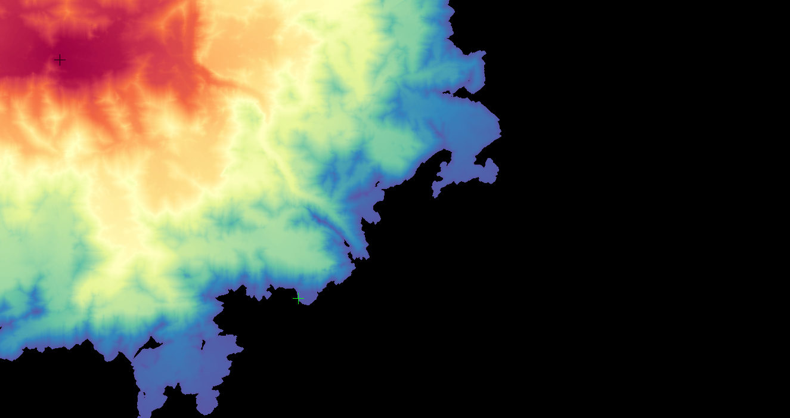
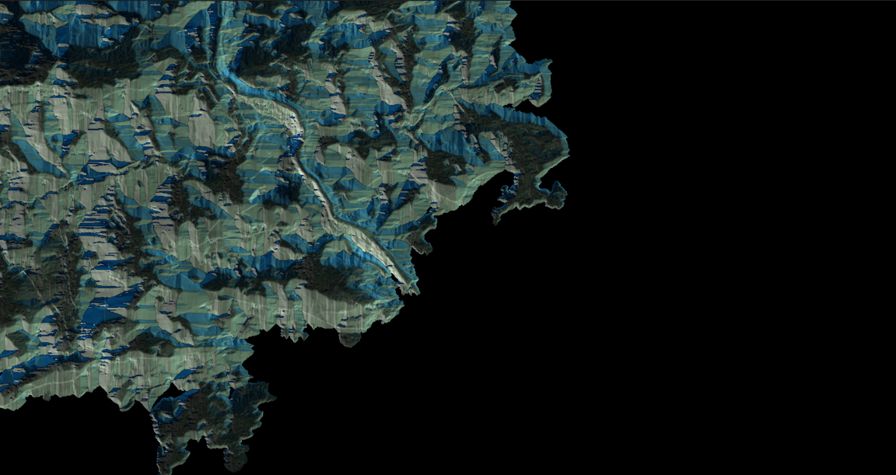
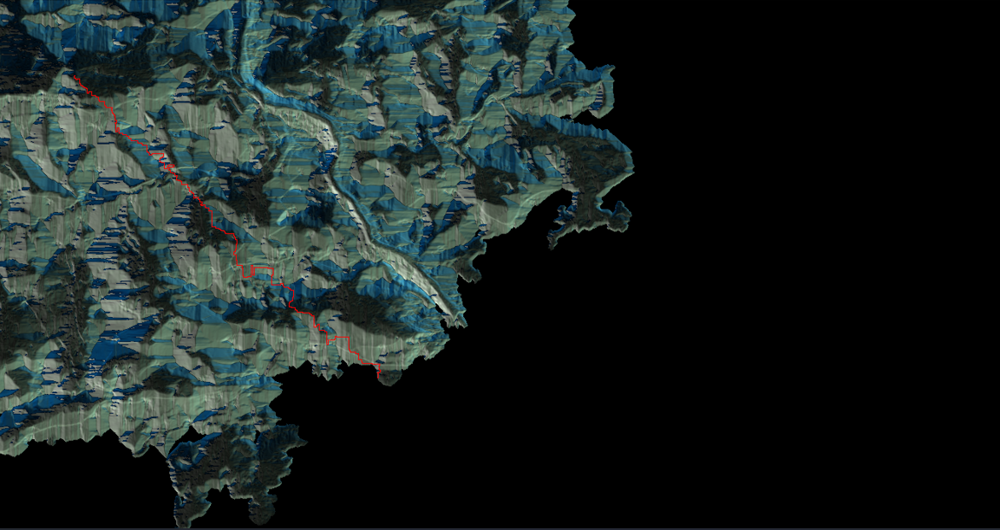

## Step 1 — Introduction


### Purpose
This project implements the Fast Marching algorithm, a generalization of Dijkstra's algorithm for continuous metrics on images. It allows optimal paths to be calculated according to potential maps, with concrete applications in:
- Searching for the shortest path on an image
- Contour detection (medical contours, roads, etc.)
- Image segmentation by point sets

---

### Language, libraries
The project is implemented in Python and uses the following libraries:
- PyQt6 for the interactive graphical interface
- NumPy for numerical calculations
- Pillow for image manipulation

--- 

### 🔗 Code references
- `dijkstra.py` — shortest-path implementation
- `edge_detection.py` — edge detection routines
- `interface.py` — demo / entry point
- `manipulation.py`, `observer.py`, `point_class.py` — utilities and classes

---

### ▶️ Quick run
Run the interface, where each action implemented in this project is available:
```
python interface.py
```

---

## Step 2 - Potential maps

### Summary 
A potential map can be anything that is an image, nevertheless, the result of the algorithm can be not relevant if the image is ill-chosen for the method. Searching an optimal path can be done thanks to this algorithm, however, it just takes into account the grey level differences, which sometimes leads to surprising results, such as going through a river...
Therefore, we will focus in this example on a picture with a small river, keeping in mind that an optimal path is only determined by the grey levels and not the physical reality. 
Above is the image.

---

### Example


*Figure — potential map (`Carte.png`)*

## Step 3 - Distances maps

### Summary
Given a starting and an ending points, we start with the distances map, whose computes the weights for each point from the beginning (in looking at each iteration for the point whose cost is minimal among all reachable steps), until reaching the ending point.

---

### Weight function
$$W(x,y)=\varepsilon+|f(x0,y0)-f(x,y)|$$

---

### Example
Distances map when the starting point is $(100,100)$ and the ending point is $(500,500)$:



*Figure — distances map (`readme_distances_map.PNG`)*

## Step 4 - Gradients map

### Summary
The gradients map is deduced from the distances map by computing the gradients on it.

---

### Example
Gradients map when the starting point is $(100,100)$ and the ending point is $(500,500)$:



*Figure — distances map (`readme_gradients_map.png`)*

## Step 5 - Gradient descent

### Summary
It remains to perform a gradient descent on the gradients map to recover the optimal path.

---

### Example
Optimal path on the gradients map when the starting point is $(100,100)$ and the ending point is $(500,500)$:



*Figure — distances map (`readme_optimal_path.png`)*

## Step 6 - Interface

The purpose of this interface is to enable the users to perform easily each step of fast marching, without needing to look for each algorithm to understand their target.

This interface is split in two parts: the keybar and the display.

--- 

### Keybar

It gathers the whole functionalities implemenented in the project:
- Select an image -> the user can load the image he wants, on which fast marching algorithm will be applied
- Erase the points -> if the user has already performed the algorithm, if he wants to perform it with other starting and ending points, he can erase the previous ones
- Original image -> it is a path for the user to remember the initial image, before the operations performed by different steps of fast marching
- Distances map -> At first click, computes and prints the distances map for the given picture. After, it just prints the distances map (it is stored, thus it does not compute it again)
- Gradients map -> At first click, computes and prints the gradients map for the given picture. After, it just prints the gradients map (it is stored, thus it does not compute it again)
- Print the optimal path -> At first click, computes and prints the optimal path on the gradients map for the given picture. After, it just prints the optimal path on the gradients map (it is stored, thus it does not compute it again)
- Edge detection -> computes and prints different distances map, enables to perform edge detection with points given by the user. See below for more information about this functionality.
- Reset edge detection -> Exits edge detection mode, back to the first interface

### Display

It prints the images given or computed, and give instructions to help the user to choose the operations in a relevant order. 

Moreover, it is necessary to show on the map the points that want to be used as starting and ending points, before performing any action. 

### Usage

The user will only use the interface, the code is a black box. To use it, it suffices to write in the terminal:

```
python interface.py
```