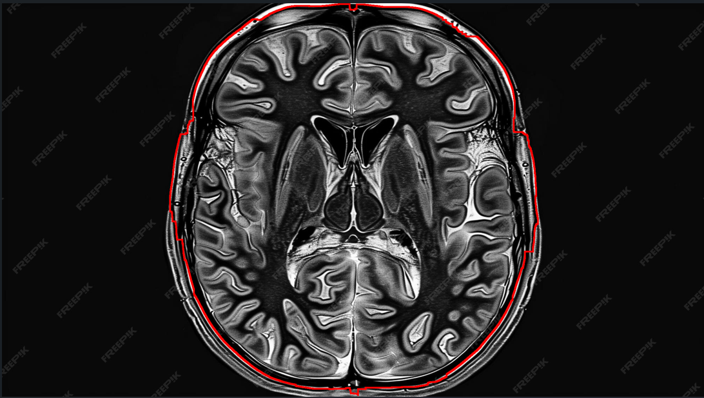

## Step 1 — Introduction


### Purpose
This project implements the Fast Marching algorithm, a generalization of Dijkstra's algorithm for continuous metrics on images. It allows optimal paths to be calculated according to potential maps, with concrete applications in:
- Searching for the shortest path on an image
- Contour detection (medical contours, roads, etc.)
- Image segmentation by point sets

---

### Language, libraries
The project is implemented in Python and uses the following libraries:
- PyQt6 for the interactive graphical interface
- NumPy for numerical calculations
- Pillow for image manipulation

--- 

### 🔗 Code references
- `dijkstra.py` — shortest-path implementation
- `edge_detection.py` — edge detection routines
- `interface.py` — demo / entry point
- `manipulation.py`, `observer.py`, `point_class.py` — utilities and classes

---

### ▶️ Quick run
Run the interface, where each action implemented in this project is available:
```
python interface.py
```

---

## Step 2 - Potential maps

### Summary 
A potential map can be anything that is an image, nevertheless, the result of the algorithm can be not relevant if the image is ill-chosen for the method. Searching an optimal path can be done thanks to this algorithm, however, it just takes into account the grey level differences, which sometimes leads to surprising results, such as going through a river...
Therefore, we will focus in this example on a picture with a small river, keeping in mind that an optimal path is only determined by the grey levels and not the physical reality. 
Above is the image.

---

### Example


*Figure — potential map (`Carte.png`)*

## Step 3 - Distances maps

### Summary
Given a starting and an ending points, we start with the distances map, whose computes the weights for each point from the beginning (in looking at each iteration for the point whose cost is minimal among all reachable steps), until reaching the ending point.

---

### Weight function
$$W(x,y)=\varepsilon+|f(x0,y0)-f(x,y)|$$

---

### Example
Distances map when the starting point is $(100,100)$ and the ending point is $(500,500)$:


*Figure — distances map (`readme_distances_map.PNG`)*

## Step 4 - Gradients map

### Summary
The gradients map is deduced from the distances map by computing the gradients on it.

---

### Example
Gradients map when the starting point is $(100,100)$ and the ending point is $(500,500)$:


*Figure — distances map (`readme_gradients_map.png`)*

## Step 5 - Gradient descent

### Summary
It remains to perform a gradient descent on the gradients map to recover the optimal path.

---

### Example
Optimal path on the gradients map when the starting point is $(100,100)$ and the ending point is $(500,500)$:


*Figure — distances map (`readme_optimal_path.png`)*

## Step 6 - Interface

The purpose of this interface is to enable the users to perform easily each step of fast marching, without needing to look for each algorithm to understand their target.

This interface is split in two parts: the keybar and the display.

--- 

### Keybar

It gathers the whole functionalities implemenented in the project:
- Select an image -> the user can load the image he wants, on which fast marching algorithm will be applied
- Erase the points -> if the user has already performed the algorithm, if he wants to perform it with other starting and ending points, he can erase the previous ones
- Original image -> it is a path for the user to remember the initial image, before the operations performed by different steps of fast marching
- Distances map -> At first click, computes and prints the distances map for the given picture. After, it just prints the distances map (it is stored, thus it does not compute it again)
- Gradients map -> At first click, computes and prints the gradients map for the given picture. After, it just prints the gradients map (it is stored, thus it does not compute it again)
- Print the optimal path -> At first click, computes and prints the optimal path on the gradients map for the given picture. After, it just prints the optimal path on the gradients map (it is stored, thus it does not compute it again)
- Edge detection -> computes and prints different distances map, enables to perform edge detection with points given by the user. See below for more information about this functionality.
- Reset edge detection -> Exits edge detection mode, back to the first interface

### Display

It prints the images given or computed, and give instructions to help the user to choose the operations in a relevant order. 

Moreover, it is necessary to show on the map the points that want to be used as starting and ending points, before performing any action. 

### Usage

The user will only use the interface, the code is a black box. To use it, it suffices to write in the terminal:

```
python interface.py
```

## Application 1 - Contour detection

### Link with fast marching 
Printing a red curve on a contour between two points on this contour can be reformulated as a shortest path problem, but with an "unusual" weight function to compute distances. Thus, fast marching may address this problem. 

### Applications

Contour detection is a problem with a wide range of applications. Let us enumerate some of them:
- Medical imaging: it checks the contours of the organs (e.g. brain) and can be used for the detection of tumors, can also be used on blood vessels
- Building detection in 3D computer vision
- Robotics: to force a robot to follow a line
- ...

### Steps 

1) Gradients: we compute gradients on the original map to get a measure of variations of grey levels. Intuitively, a high gradient embodies a large variation of color, which can suggest the presence of a contour. 

2) Gaussian filter: this blurred a bit the picture, and aims at discarding the noise existing in some points. The different areas are then more continuous, so the contours are better visible.

3) Inversion: let us recall that fast marching minimizes the cost, and we were looking for higher gradients, thus for lower inverses of gradients. 

It explains the final weight function:

$$W(x,y)=\frac{1}{\varepsilon + G\sigma * G(x,y)}$$

4) Path on a contour: when we choose two points on a (same) contour, it is always less costly to remain on the contour (since the cost is close to 0), then we get a section of the contour. 

5) Getting the whole contour: heuristically, we add smartly two points on the contour, that are well spread, so that tracing the paths between the points and their "following" (given an orientation) enables to recover the whole contour.

### Example

Let us consider this medical image:


*Figure — distances map (`readme_example_medical.jpg`)*

The result is:



*Figure — distances map (`readme_contour_detection.png`)*

### How it works with the interface?

After the choice of an image, we enter the mode "contour detection" by clicking on the button **edge detection**. The maps from steps 1, 2, 3, are computed, and we can observe them by using the button **Next image**. After, you are invited to choose two points on a contour, and let the last step be achieved by clicking on **Draw edges**.
Eventually, feel free to compare all the images obtained by using the buttons appeared for this purpose. 
To leave this mode, just click on **Reset edge detection**. 

## Application 2 - Image segmentation

The problem of image segmentation can be resolved with the distances map only. We implemented this method to segment an image.

### Applications

Image segmentation is a problem with a wide range of applications. Let us enumerate some of them:
- Medical images : it helps analysing and certifying organs, cells, tumours,...
- Autonous driving : it helps the car to identify others vehicles and obtacles on the road
- ...

### Steps

1) Let the user choose some initial points on the image

2) Then compute the distances maps from all the points chosen (1 distance map for 1 point)

3) Finally take every pixel of the image and see from which initial point it is the nearest by using the distances maps

### Example

Let us consider this labyrinth image : 


The result of the segmentation is :


### How it works with the interface?

After the choice of an image, we enter the mode "image segmentation" by clicking on the button **image segmentation**. After, you are invited to choose as many points as you want on the image. When you have chosen all the points you wanted, just click on **All points chosen**
To leave this mode, just click on **Reset segmentation**. 